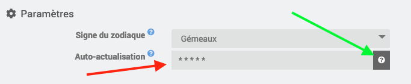
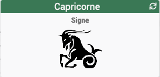
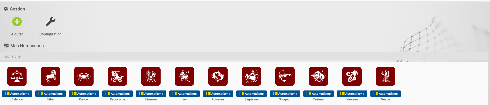
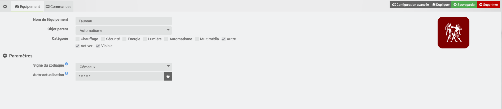
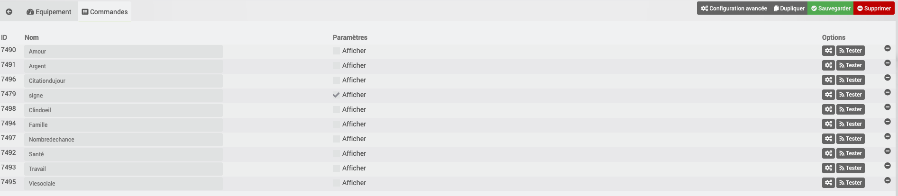
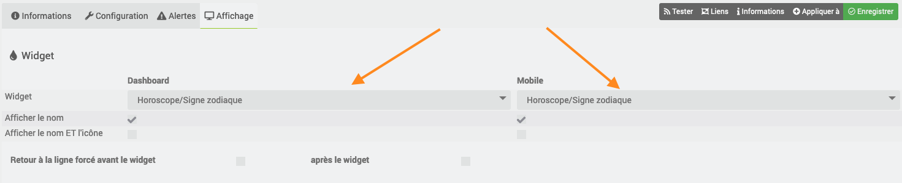

# Description

Ce plugin permet de récupérer son horoscope tous les jours de façon automatique ou manuelle.

Plusieurs phrases sont disponibles chaque jours en fonction de thèmes comme Amour, Argent, Famille, Santé, ...
Une phrase symbolique est également disponible.

Ceci peut être très pratique afin de donner l'horoscope du jour à une personne (via une caméra Netatmo par exemple) ou par TTS tous les jours.

# Configuration

Le plugin ne comporte pas de configuration particulière.

Il est possible de configurer un cron pour activer le relever automatique.

> Il est conseillé de configurer l'Auto-actualisation à 5h du matin tous les jours.

Un widget est appliqué automatiquement sur la commande **signe**

# FAQ

-   Est-ce que ce plugin s'appuie sur des API tiers ?

>Le plugin n'utilise que du PHP  pour aller chercher les informations (après découpage) sur un site d'astrologie.

-   Pourquoi est-il conseillé de régler le cron d'actualisation à ***5H du matin*** ?

>Ne connaissant pas exactement l'heure d'actualisation du site internet, il est préférable de le faire tôt dans la matinée.
>

# Exemple de configuration
## Vue de la liste des équipements

## Exemple de configuration

# Troubleshotting

- Je n'ai aucune commandes de créer à part de **signe**

>Les commandes sont créées automatiquement après la première actualisation de l'équipement.
>

- Je n'ai pas d'actualisation automatique

>Il faut vérifier la présence d'une valeur dans l'option "Auto-actualisation" *(flèche rouge)*

>On peut régler le temps avec le bouton **?** *(flèche verte)
*

- L'icône sur la liste des équipements ne correspond pas au **signe**

>Il faut vérifier que la présence d'une valeur dans l'option "Signe du zodiaque"
>

- Le widget n'est pas correct sur la commande **signe**

>Il faut vérifier que la configuration de la commande que le widget est ***Horoscope/Signe zodiaque***

