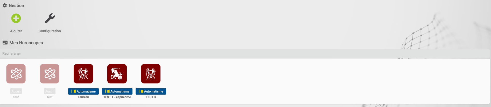
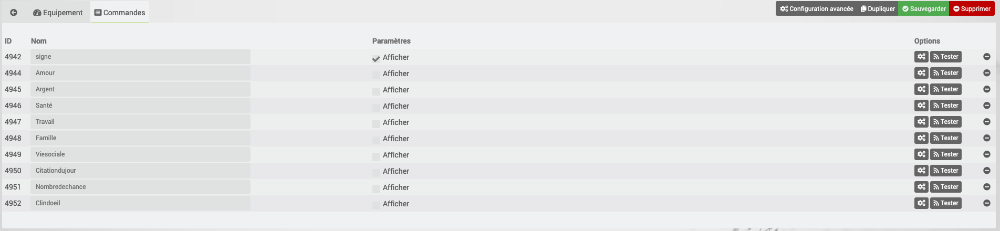

# Description

Ce Plugin permet de récupérer son horoscope tous les jours.

Plusieurs phrases sont disponibles chaque jours en fonction de thèmes comme Amour,Argent,Famille,Santé,...
Une phrase symbolique est également disponible.

Ceci peut-être très pratique afin de donner l'horoscope du jour à une personne (via une caméra Netatmo par exemple) ou par TTS tous les jours.

# Configuration

Le plugin ne comporte pas de configuration particuliere

# FAQ

-   Est-ce que ce plugin s'appuie sur des API tiers ?

>Le plugin n'utilise que du PHP  pour aller chercher les informations (après découpage) sur un site d'astrologie.

-   Pourquoi est-il conseillé de régler le cron d'actualisation à 5H du matin ? ?

>Ne connaissant pas exactement l'heure d'actualisation du site internet, il est préférable de le faire tôt dans la matinée.
>

# Exemple de configuration
## Vue de la liste des équipements

## Exemple de configuration

